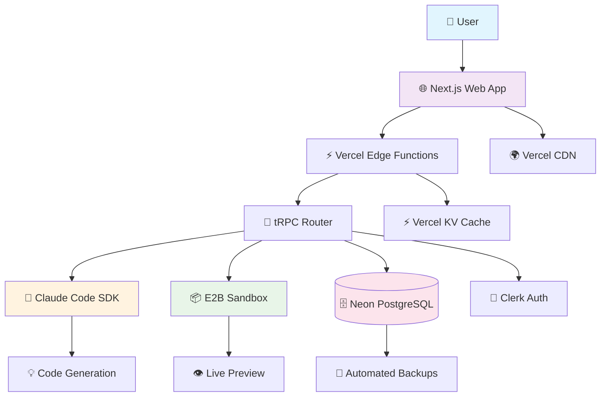
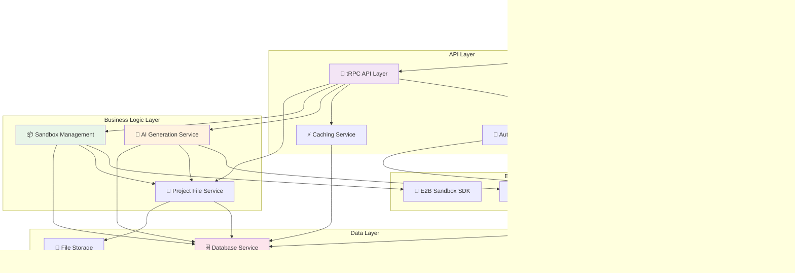
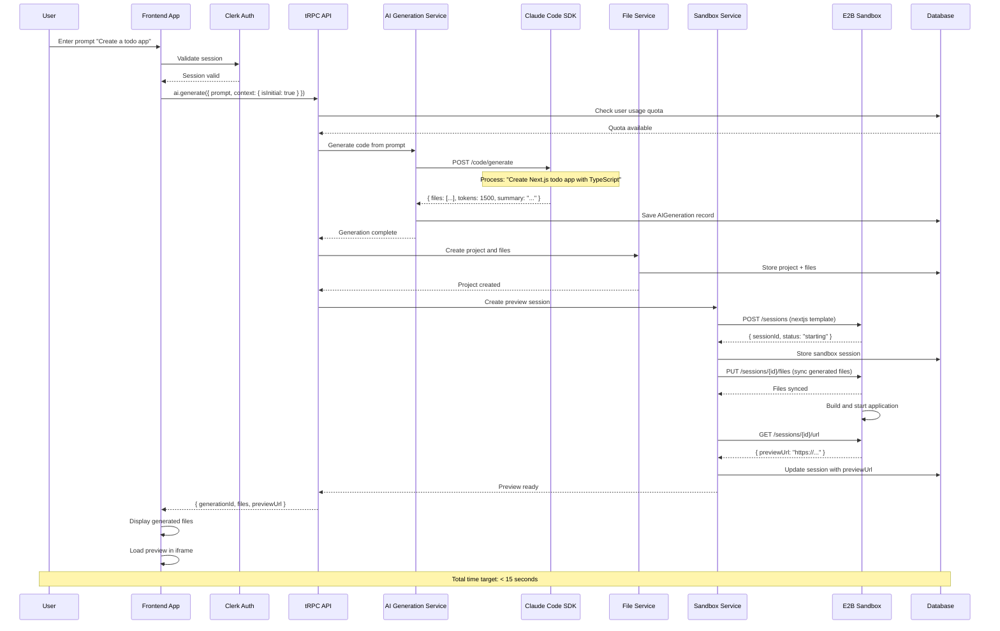
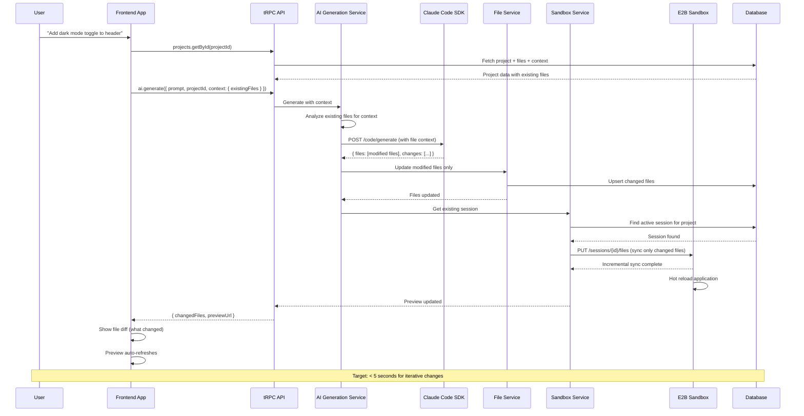
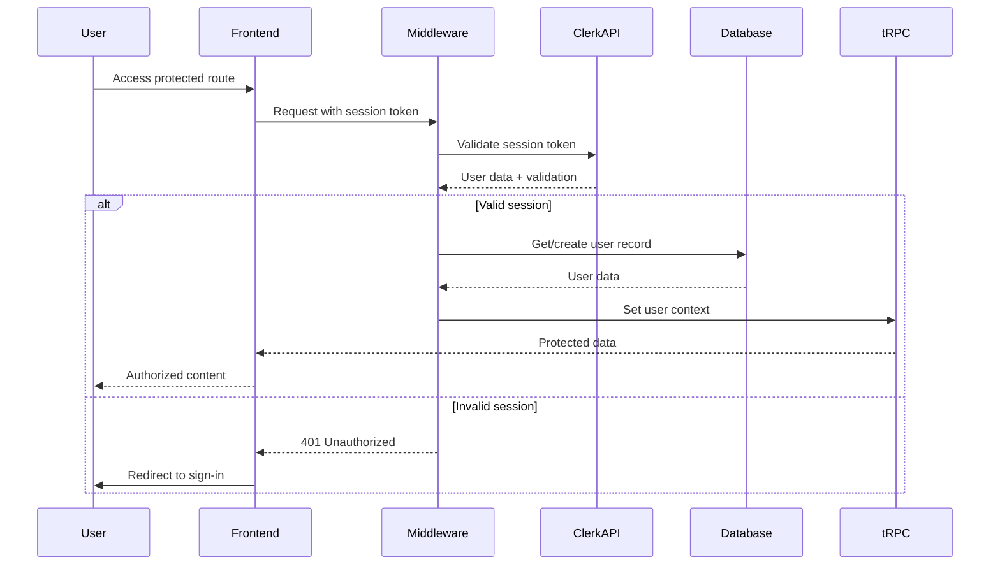

# Stryama Fullstack Architecture Document

## Introduction

This document outlines the complete fullstack architecture for **Stryama**, a conversational AI-powered application development platform. The architecture leverages a **serverless-first, TypeScript monorepo** approach built on the proven T3 Stack foundation, enhanced with Claude Code SDK for AI generation and E2B for sandboxed execution.

The system employs a **conversation-driven development paradigm** where users describe applications in natural language, triggering AI code generation that produces functional Next.js applications with real-time preview capabilities. The architecture prioritizes sub-5 second response times, 99.5% uptime, and seamless integration between AI generation, code execution, and user experience.

Key integration points include **tRPC for type-safe API communication** between frontend and AI services, **Prisma for robust data persistence** of projects and generation history, and **E2B sandboxed environments** for secure code preview. The infrastructure leverages **Vercel's edge functions** for global distribution and automatic scaling, with **Clerk handling authentication** and **PostgreSQL managing persistent state**.

This unified architecture ensures that every prompt-to-preview cycle maintains consistency across the entire stack while supporting the platform's ambitious goal of enabling 10,000 users to create functional applications within 15 minutes of first use.

### Starter Template or Existing Project

Based on your PRD (Story 1.1), this project is built on the **T3 Stack** foundation (`pnpm create t3-app@latest`), which provides:

- ✅ **Next.js 15+** with App Router and TypeScript
- ✅ **Prisma ORM** with PostgreSQL
- ✅ **tRPC** for end-to-end type safety
- ✅ **Tailwind CSS** ready for ShadCN integration
- ✅ **NextAuth.js** (replaced with Clerk per specifications)

**Architectural Constraints from T3:**
- Monorepo structure with clear separation
- tRPC for API communication (excellent for Claude Code SDK integration)
- Serverless-first approach (perfect for Vercel deployment)
- TypeScript strict mode throughout

### Change Log

| Date | Version | Description | Author |
|------|---------|-------------|---------|
| 2025-09-28 | 1.2 | Enforced high code standards: replaced all magic strings (3+) with enums, converted interfaces to types, eliminated any types, added readonly properties | System Architect |
| 2025-09-28 | 1.1 | Updated technology stack with latest stable versions, added Ref MCP documentation research requirements | System Architect |
| 2025-09-28 | 1.0 | Initial architecture document creation | System Architect |

## High Level Architecture

### Technical Summary

This architecture leverages a **serverless-first, TypeScript monorepo** approach built on the T3 Stack foundation, enhanced with Claude Code SDK for AI generation and E2B for sandboxed execution. The system employs a **conversation-driven development paradigm** where users describe applications in natural language, triggering AI code generation that produces functional Next.js applications with real-time preview capabilities.

The architecture prioritizes sub-5 second response times, 99.5% uptime, and seamless integration between AI generation, code execution, and user experience. Key integration points include **tRPC for type-safe API communication**, **Prisma for robust data persistence**, and **E2B sandboxed environments** for secure code preview. The infrastructure leverages **Vercel's edge functions** for global distribution and automatic scaling.

### Platform and Infrastructure Choice

**Platform:** Vercel + Neon
**Key Services:**
- Vercel Edge Functions (API routes)
- Neon PostgreSQL (primary database)
- Vercel Analytics (performance monitoring)
- Vercel KV (Redis caching)

**Deployment Host and Regions:**
- Primary: Vercel Edge Network (global)
- Database: Neon US-East-1 with read replicas

### Repository Structure

**Structure:** Monorepo with T3 Stack foundation
**Monorepo Tool:** Native Next.js + pnpm workspaces (keeping T3 simplicity)
**Package Organization:**
- `/src` - Main application code
- `/prisma` - Database schema and migrations
- `/public` - Static assets
- `/packages/shared` - Shared types and utilities (for future expansion)

### High Level Architecture Diagram



### Architectural Patterns

- **Jamstack Architecture:** Static site generation with serverless APIs - _Rationale:_ Optimal performance and global distribution for conversation-driven interface
- **Component-Based UI:** Reusable React components with TypeScript - _Rationale:_ Maintainability and type safety across complex AI generation workflows
- **Repository Pattern:** Abstract data access through Prisma - _Rationale:_ Enables testing and future database migration flexibility
- **API Gateway Pattern:** tRPC as single entry point for all API calls - _Rationale:_ Centralized auth, validation, and type safety for AI integration
- **Event-Driven Architecture:** Async AI generation with progress events - _Rationale:_ Enables real-time user feedback during code generation
- **Hexagonal Architecture:** Core business logic isolated from external services - _Rationale:_ Facilitates testing and swapping AI providers if needed

## Tech Stack

### Technology Stack Table - Latest Stable Versions (Updated 2025-09-28)

| Category | Technology | Version | Purpose | Rationale |
|----------|------------|---------|---------|-----------|
| Package Manager | PNPM | 9.15.4+ | Fast, efficient package management | Disk space efficient, faster than npm/yarn, excellent monorepo support |
| Runtime | Node.js | 20+ LTS | JavaScript runtime | Latest LTS version with stable features and long-term support |
| Frontend Language | TypeScript | 5.8+ | Type-safe frontend development | Prevents runtime errors in AI generation workflows, essential for complex state management |
| Frontend Framework | Next.js | 15.3+ | React framework with App Router | Built-in optimization, serverless functions, perfect T3 Stack integration |
| React Library | React | 19.0+ | UI library | Latest stable with improved concurrent features and performance |
| UI Component Library | ShadCN/UI | Latest (v4 compatible) | Accessible component system | Updated for Tailwind v4, built on Radix for accessibility |
| State Management | Zustand | 5.0+ | Lightweight state management | Latest with improved TypeScript support and React 18+ compatibility |
| Backend Language | TypeScript | 5.8+ | Unified language across stack | Single language reduces complexity, shared types between frontend/backend |
| Backend Framework | Next.js API Routes | 15.3+ | Serverless API endpoints | Leverages existing Next.js infrastructure, perfect for tRPC integration |
| API Style | tRPC | 11.0+ | End-to-end type safety | Latest with FormData support, React Server Components, and streaming |
| Database ORM | Prisma | 6.5+ | Type-safe database access | Latest stable with improved performance and developer experience |
| Database | PostgreSQL | 15+ | Primary data persistence | ACID compliance for project data, excellent Prisma support |
| Cache | Vercel KV (Redis) | Latest | Response and session caching | Sub-5 second performance requirements, seamless Vercel integration |
| File Storage | Vercel Blob Storage | Latest | Generated code and assets | Integrated with deployment platform, CDN benefits |
| Authentication | Clerk | Latest | User auth and management | Superior OAuth integration, user management features per PRD |
| AI Integration | Claude Code SDK | Latest | AI-powered code generation | Primary AI engine with latest model capabilities and performance |
| Sandbox Service | E2B SDK | v2+ | Secure code execution | Latest version with improved security and performance |
| Build Tool | Next.js Build | 15.3+ | Production optimization | Built-in optimization, code splitting, image optimization |
| Bundler | Turbopack | Latest | Fast development builds | Next.js 15+ default, significantly faster than Webpack |
| Linting | ESLint | 9+ | Code quality and standards | Latest with improved TypeScript and React support |
| Formatting | Prettier | 3.5+ | Code formatting | Consistent code style across the project |
| IaC Tool | Vercel CLI + Terraform | Latest | Infrastructure management | Vercel CLI for deployment, Terraform for external resources |
| CI/CD | GitHub Actions | Latest | Automated testing and deployment | Free for public repos, excellent Next.js/Vercel integration |
| Monitoring | Vercel Analytics + Sentry | Latest | Performance and error tracking | Built-in performance monitoring, comprehensive error tracking |
| Logging | Axiom | Latest | Structured logging and search | Serverless-friendly, excellent search capabilities |
| CSS Framework | Tailwind CSS | 4.0+ (Beta) | Utility-first styling | Latest v4 with improved performance and modern features |

### Version Update Policy

**Staying Current with Latest Documentation:**
- All development team members must use Ref MCP to research latest stable versions before implementing any new features
- When integrating any tool or library, always reference the most current documentation using Ref MCP search
- Monthly version audits should be conducted to ensure all dependencies remain current
- Breaking changes must be evaluated and migration plans created for major version updates
- Development environments should be regularly updated to match production requirements

**Critical Version Notes:**
- **Tailwind CSS v4.0**: Currently in beta but offers significant performance improvements
- **tRPC v11**: Includes breaking changes from v10, adds FormData support and React Server Components
- **Zustand v5**: Breaking changes from v4, requires migration for custom equality functions
- **Next.js 15.3+**: Required for latest ShadCN/UI compatibility and performance improvements
- **E2B SDK v2**: Breaking changes from v1, improved security and API design

## Data Models

### User

**Purpose:** Represents authenticated users with Clerk integration, tracking their projects and AI generation usage for freemium business model support.

**Key Attributes:**
- clerkId: string - Unique Clerk user identifier for auth integration
- email: string - User email address for communication
- createdAt: Date - Account creation timestamp
- updatedAt: Date - Last profile update timestamp
- plan: enum - Subscription tier (free, pro, enterprise) for rate limiting
- usageQuota: number - Monthly AI generation quota based on plan

#### TypeScript Type Definition

```typescript
// ✅ Use enum for 3+ subscription plans
enum UserPlan {
  FREE = 'free',
  PRO = 'pro',
  ENTERPRISE = 'enterprise'
}

// ✅ Always use 'type' instead of 'interface'
type User = {
  readonly id: string;
  readonly clerkId: string;
  readonly email: string;
  readonly name?: string;
  readonly imageUrl?: string;
  readonly plan: UserPlan;
  readonly usageQuota: number;
  readonly usageCount: number;
  readonly resetDate: Date;
  readonly createdAt: Date;
  readonly updatedAt: Date;
}
```

#### Relationships
- One-to-many with Project (user owns multiple projects)
- One-to-many with AIGeneration (user has generation history)
- One-to-many with SandboxSession (user has active sandbox environments)

### Project

**Purpose:** Container for user applications with complete file structure, prompt history, and metadata. Central entity for the conversational development workflow.

**Key Attributes:**
- name: string - User-defined project name
- description: string - Project description and purpose
- framework: string - Generated framework type (Next.js, React, etc.)
- fileStructure: JSON - Complete file tree with metadata
- lastPreviewUrl: string - Last generated E2B preview URL
- status: enum - Project development status

#### TypeScript Type Definition

```typescript
// ✅ Use enum for 4+ framework types
enum FrameworkType {
  NEXTJS = 'nextjs',
  REACT = 'react',
  VANILLA = 'vanilla',
  CUSTOM = 'custom'
}

// ✅ Use enum for 4+ project statuses
enum ProjectStatus {
  DRAFT = 'draft',
  ACTIVE = 'active',
  ARCHIVED = 'archived',
  SHARED = 'shared'
}

// ✅ Properly typed file structure
type FileStructure = Record<string, {
  type: 'file' | 'directory';
  content?: string;
  children?: FileStructure;
}>;

type Project = {
  readonly id: string;
  readonly userId: string;
  readonly name: string;
  readonly description?: string;
  readonly framework: FrameworkType;
  readonly fileStructure: FileStructure;
  readonly lastPreviewUrl?: string;
  readonly status: ProjectStatus;
  readonly isPublic: boolean;
  readonly shareToken?: string;
  readonly createdAt: Date;
  readonly updatedAt: Date;
}
```

#### Relationships
- Many-to-one with User (project belongs to user)
- One-to-many with File (project contains multiple files)
- One-to-many with AIGeneration (project has generation history)
- One-to-one with SandboxSession (project has active sandbox)

### File

**Purpose:** Individual code files within projects, storing content, metadata, and change tracking for the iterative development workflow.

**Key Attributes:**
- path: string - File path within project structure
- content: text - File content (code, markup, etc.)
- language: string - Programming language for syntax highlighting
- size: number - File size for storage tracking
- lastModified: Date - Change tracking for incremental updates

#### TypeScript Type Definition

```typescript
// ✅ Use enum for 6+ programming languages
enum ProgrammingLanguage {
  TYPESCRIPT = 'typescript',
  JAVASCRIPT = 'javascript',
  CSS = 'css',
  HTML = 'html',
  JSON = 'json',
  MARKDOWN = 'markdown'
}

type File = {
  readonly id: string;
  readonly projectId: string;
  readonly path: string;
  readonly content: string;
  readonly language: ProgrammingLanguage;
  readonly size: number;
  readonly isGenerated: boolean;
  readonly generationId?: string;
  readonly createdAt: Date;
  readonly lastModified: Date;
}
```

#### Relationships
- Many-to-one with Project (file belongs to project)
- Many-to-one with AIGeneration (file created by specific generation)

### AIGeneration

**Purpose:** Tracks AI code generation requests, responses, and metrics for analytics, debugging, and billing purposes. Critical for improving generation quality.

**Key Attributes:**
- prompt: text - User's natural language input
- systemPrompt: text - AI system prompt used for generation
- response: JSON - Complete AI response with metadata
- tokens: number - Token usage for billing and optimization
- duration: number - Generation time for performance tracking
- success: boolean - Generation success/failure status

#### TypeScript Type Definition

```typescript
type AIGeneration = {
  readonly id: string;
  readonly userId: string;
  readonly projectId?: string;
  readonly prompt: string;
  readonly systemPrompt: string;
  readonly response: {
    readonly files: Array<{
      readonly path: string;
      readonly content: string;
      readonly language: ProgrammingLanguage;
    }>;
    readonly summary: string;
    readonly metadata: Record<string, unknown>;
  };
  readonly tokens: number;
  readonly duration: number;
  readonly success: boolean;
  readonly errorMessage?: string;
  readonly claudeRequestId?: string;
  readonly createdAt: Date;
}
```

#### Relationships
- Many-to-one with User (generation belongs to user)
- Many-to-one with Project (generation modifies project)
- One-to-many with File (generation creates/modifies files)

### SandboxSession

**Purpose:** Manages E2B sandbox environments for live preview functionality, tracking resource usage and session lifecycle.

**Key Attributes:**
- e2bSessionId: string - E2B platform session identifier
- status: enum - Sandbox lifecycle status
- previewUrl: string - Live preview URL for iframe embedding
- lastActivity: Date - For cleanup and resource management
- resourceUsage: JSON - CPU, memory, and network usage tracking

#### TypeScript Type Definition

```typescript
// ✅ Use enum for 4+ sandbox statuses
enum SandboxStatus {
  STARTING = 'starting',
  READY = 'ready',
  ERROR = 'error',
  STOPPED = 'stopped'
}

type SandboxSession = {
  readonly id: string;
  readonly projectId: string;
  readonly userId: string;
  readonly e2bSessionId: string;
  readonly status: SandboxStatus;
  readonly previewUrl?: string;
  readonly lastActivity: Date;
  readonly resourceUsage: {
    readonly cpu: number;
    readonly memory: number;
    readonly network: number;
  };
  readonly createdAt: Date;
  readonly expiresAt: Date;
}
```

#### Relationships
- One-to-one with Project (sandbox serves one project)
- Many-to-one with User (user owns sandbox session)

## API Specification

### tRPC Router Architecture

The API layer uses tRPC for end-to-end type safety, organized by domain with clear separation of concerns:

```typescript
// Main router composition
export const appRouter = createTRPCRouter({
  auth: authRouter,        // User authentication and profile
  projects: projectRouter, // Project CRUD operations
  ai: aiRouter,           // AI code generation
  sandbox: sandboxRouter, // E2B sandbox management
  files: fileRouter,      // File operations
});

// Router patterns follow consistent structure:
export const aiRouter = createTRPCRouter({
  generate: protectedProcedure
    .input(aiGenerationSchema)
    .mutation(async ({ ctx, input }) => {
      // 1. Validate user quota
      // 2. Process AI generation
      // 3. Store results
      // 4. Return generated files
    }),
});

export type AppRouter = typeof appRouter;
```

### API Design Principles

- **Type Safety**: All inputs/outputs validated with Zod schemas
- **Authentication**: Protected procedures use Clerk middleware
- **Error Handling**: Consistent TRPCError patterns across all routers
- **Rate Limiting**: Usage quota enforcement at procedure level
- **Context Injection**: Database and auth context available in all procedures

### Key API Patterns

1. **Input Validation**: Every procedure uses Zod schemas for type-safe validation
2. **Error Recovery**: Standardized error codes and user-friendly messages
3. **Usage Tracking**: Automatic logging of AI generations for billing
4. **Context Awareness**: AI procedures receive project context for better results
5. **Real-time Updates**: Subscription patterns for live preview updates

### tRPC Procedure Dependencies and Sequencing

**Startup Sequence (Application Initialization):**
1. `auth.getCurrentUser` - Validate session and load user data
2. `projects.list` - Load user's project list for dashboard
3. External service health checks (Claude API, E2B status)

**Project Creation Flow:**
1. `auth.getCurrentUser` - Ensure authenticated user
2. `projects.create` - Create project record in database
3. `files.createDefault` - Initialize default project files
4. `projects.getById` - Return complete project with files

**AI Generation Flow:**
1. `auth.getCurrentUser` - Validate user and check quota
2. `projects.getById` - Load project context for AI generation
3. `ai.generate` - Process AI generation with context
4. `files.upsertMany` - Update project files with generated content
5. `sandbox.syncFiles` - Synchronize files to preview environment
6. `sandbox.getPreviewUrl` - Return updated preview URL

**Iterative Development Flow:**
1. `projects.getById` - Load current project state
2. `ai.generateWithContext` - Generate changes with existing context
3. `files.updateMany` - Apply incremental file changes
4. `sandbox.updateFiles` - Sync only changed files to sandbox
5. `projects.updateModified` - Update project metadata

**Error Recovery Patterns:**
- All mutations implement automatic retry with exponential backoff
- Failed AI generations trigger quota validation and user notification
- Sandbox failures fall back to cached preview with error indication
- Database conflicts resolved through optimistic locking patterns

### API Testing Strategy

**Unit Testing (Procedure Level):**
```typescript
// Test individual tRPC procedures with mocked dependencies
describe('ai.generate', () => {
  it('should validate user quota before generation', async () => {
    const ctx = createMockContext({ user: mockUser });
    await expect(aiRouter.generate(ctx, mockInput)).rejects.toThrow('Quota exceeded');
  });
});
```

**Integration Testing (Flow Level):**
```typescript
// Test complete user flows with real database and mocked external services
describe('Project Creation Flow', () => {
  it('should create project and initialize files', async () => {
    const result = await testClient.projects.create.mutate(mockProject);
    expect(result.files).toHaveLength(3);
    expect(result.status).toBe('active');
  });
});
```

**External Service Mocking:**
```typescript
// Mock external APIs for reliable testing
export const mockClaudeAPI = {
  generate: jest.fn().mockResolvedValue(mockGenerationResponse),
  checkUsage: jest.fn().mockResolvedValue({ remaining: 1000 }),
};

export const mockE2BAPI = {
  createSession: jest.fn().mockResolvedValue({ sessionId: 'test-123' }),
  syncFiles: jest.fn().mockResolvedValue({ success: true }),
};
```

## Components

### Frontend Application Layer

**Responsibility:** Provides the conversational development type, real-time preview capabilities, and responsive user experience as defined in the frontend specification.

**Key types:**
- React components with TypeScript props for type safety
- tRPC client hooks for API communication
- Zustand stores for state management
- ShadCN/UI component composition

**Dependencies:** tRPC API Layer, Authentication Service, Browser APIs

**Technology Stack:** Next.js 15+ with App Router, React 18+, TypeScript, ShadCN/UI, Tailwind CSS, Zustand

### tRPC API Layer

**Responsibility:** Provides end-to-end type-safe API communication between frontend and backend services, handling authentication, validation, and error management.

**Key types:**
- Router procedures for all business operations
- Input/output validation with Zod schemas
- Middleware for auth and rate limiting
- Error handling with TRPCError

**Dependencies:** Database Service, Authentication Service, External API Integrations

**Technology Stack:** tRPC 10.45+, Next.js API Routes, Zod validation, Clerk authentication

### AI Generation Service

**Responsibility:** Orchestrates AI-powered code generation using Claude Code SDK, manages prompts, context analysis, and response processing for the conversational development workflow.

**Key types:**
- Code generation API with context awareness
- Prompt engineering and template system
- Usage tracking and quota management
- Error recovery and retry mechanisms

**Dependencies:** Claude Code SDK, Database Service, Project File Service

**Technology Stack:** Claude Code SDK, TypeScript, Zod validation, Next.js serverless functions

### Sandbox Management Service

**Responsibility:** Manages E2B sandbox environments for live preview functionality, handles file synchronization, resource monitoring, and session lifecycle.

**Key types:**
- Sandbox session creation and management
- File synchronization to sandboxed environments
- Preview URL generation and management
- Resource usage tracking and cleanup

**Dependencies:** E2B SDK, Database Service, Project File Service

**Technology Stack:** E2B SDK, TypeScript, Next.js serverless functions, resource monitoring APIs

### Component Diagrams



## AI-Specific Development Patterns

### Prompt Engineering

```typescript
const PROMPT_TEMPLATES = {
  codeGeneration: {
    systemPrompt: `You are an expert web developer. Generate clean, production-ready code following best practices.`,

    userPromptTemplate: (request: {
      description: string;
      framework: string;
      existingFiles?: string;
    }) => `
Create a ${request.framework} application: ${request.description}

${request.existingFiles ? `Context:\n${request.existingFiles}` : ''}

Provide complete files with proper TypeScript, error handling, and accessibility.
`,
  },
};
```

### AI Response Processing

```typescript
const aiResponseSchema = z.object({
  files: z.array(z.object({
    path: z.string(),
    content: z.string(),
    language: z.string(),
  })),
  explanation: z.string(),
});

export async function processAIResponse(rawResponse: string) {
  // Parse and validate
  const parsed = aiResponseSchema.parse(JSON.parse(rawResponse));

  // Sanitize code content
  const sanitizedFiles = parsed.files.map(file => ({
    ...file,
    content: sanitizeCode(file.content),
  }));

  // Security check
  validateSecureCode(sanitizedFiles);

  return sanitizedFiles;
}
```

### Error Recovery

```typescript
export class AIErrorRecovery {
  async handleFailure(error: Error, originalRequest: AIRequest) {
    const errorType = this.classifyError(error);

    switch (errorType) {
      case 'RATE_LIMIT_EXCEEDED':
        await this.delay(5000);
        return this.retryWithBackoff(originalRequest);

      case 'TOKEN_LIMIT_EXCEEDED':
        const simplified = this.simplifyRequest(originalRequest);
        return this.retryRequest(simplified);

      case 'INVALID_RESPONSE':
        return this.generateFromTemplate(originalRequest);

      default:
        throw new AIRecoveryError('No recovery strategy available');
    }
  }
}
```

### Usage Tracking

```typescript
export async function trackAIGeneration(data: {
  userId: string;
  prompt: string;
  response: AIResponse;
  duration: number;
  success: boolean;
}) {
  await db.aIGeneration.create({
    data: {
      userId: data.userId,
      promptLength: data.prompt.length,
      promptComplexity: calculateComplexity(data.prompt),
      responseTokens: data.response.files.reduce((sum, file) => sum + file.content.length, 0),
      duration: data.duration,
      success: data.success,
      filesGenerated: data.response.files.length,
    },
  });
}
```

## External APIs

### Documentation Research Protocol

**CRITICAL FOR DEVELOPMENT TEAM:** Before implementing any integration with external APIs or services, developers MUST use Ref MCP to research the latest documentation:

```bash
# Example Ref MCP searches for staying current
ref_search_documentation "Claude Code SDK latest version 2025 documentation"
ref_search_documentation "E2B sandbox latest stable version 2025 documentation"
ref_search_documentation "tRPC latest stable version 2025 documentation"
```

**Documentation Research Requirements:**
- Always search for "latest stable version 2025" + technology name
- Read the actual documentation URLs returned by Ref MCP
- Verify API endpoints, authentication methods, and rate limits
- Check for breaking changes in recent versions
- Update architecture document when significant changes are found

### Claude Code SDK API

- **Purpose:** Primary AI engine for natural language to code generation, providing the core value proposition of conversational application development
- **Documentation:** https://docs.anthropic.com/claude/docs/claude-code (verify latest with Ref MCP)
- **Base URL(s):** https://api.anthropic.com/v1/
- **Authentication:** API Key authentication via Authorization header
- **Rate Limits:**
  - Tier 1: 5 requests/minute, 40,000 tokens/minute
  - Tier 2: 50 requests/minute, 400,000 tokens/minute
  - Tier 3: 1000 requests/minute, 2,000,000 tokens/minute

**Key Endpoints Used:**
- `POST /code/generate` - Generate code from natural language prompts with context
- `POST /code/analyze` - Analyze existing code for context-aware modifications
- `POST /code/refactor` - Intelligent code refactoring and optimization
- `GET /usage` - Track token usage and rate limit status

**Authentication Flow:**
1. API key obtained through Anthropic Console during development setup
2. Key stored in environment variables with validation on application startup
3. Request headers: `Authorization: Bearer ${CLAUDE_API_KEY}`, `anthropic-version: 2023-06-01`
4. Request rate limiting enforced with exponential backoff (initial: 1s, max: 60s)
5. Token usage tracked per request for billing and quota management

**Integration Notes:**
- Implements retry logic with exponential backoff for rate limit handling
- Context window management for large projects (max 200k tokens)
- Prompt engineering templates for consistent generation quality
- Error classification for user-friendly error messages
- Token usage tracking for billing and quota management

**Fallback Strategies:**
- **Rate Limit Exceeded**: Queue requests with exponential backoff, show user estimated wait time
- **API Unavailable**: Use cached template responses for common patterns, notify user of service status
- **Token Limit Exceeded**: Split large requests into smaller chunks, implement smart context pruning
- **Invalid Response**: Retry with simplified prompt template, escalate to error handling if persistent
- **Network Timeout**: Implement client-side timeout (30s), retry with shorter timeout, provide manual retry option

### E2B Sandbox API

- **Purpose:** Secure, isolated code execution environments for real-time application preview and testing
- **Documentation:** https://e2b.dev/docs/api (verify latest SDK v2 with Ref MCP)
- **Base URL(s):** https://api.e2b.dev/v1/
- **Authentication:** API Key authentication via x-api-key header
- **SDK Version:** v2+ (breaking changes from v1, use Ref MCP to verify migration requirements)
- **Rate Limits:**
  - Free tier: 100 sessions/month, 2 concurrent sessions
  - Pro tier: 1000 sessions/month, 10 concurrent sessions
  - Enterprise: Custom limits

**Key Endpoints Used:**
- `POST /sessions` - Create new sandbox session with template configuration
- `PUT /sessions/{id}/files` - Synchronize project files to sandbox environment
- `GET /sessions/{id}/url` - Get live preview URL for iframe embedding
- `GET /sessions/{id}/status` - Monitor sandbox health and resource usage
- `DELETE /sessions/{id}` - Cleanup and terminate sandbox sessions
- `GET /sessions/{id}/logs` - Retrieve console output and error logs

**Authentication Flow:**
1. API key obtained through E2B Console during development setup
2. Key stored in environment variables with validation on startup
3. Request headers: `x-api-key: ${E2B_API_KEY}`, `Content-Type: application/json`
4. Session authentication maintained through session tokens
5. Resource usage tracked per session for billing management

**Integration Notes:**
- Session pooling to reduce cold start times for better UX
- Automatic file synchronization on AI generation completion
- Resource monitoring to prevent cost overruns
- Session lifecycle management with automatic cleanup
- WebSocket integration for real-time console output
- Template pre-configuration for Next.js, React, and vanilla JavaScript

**Fallback Strategies:**
- **Session Creation Failed**: Retry with different template, queue request if quotas exceeded
- **File Sync Failed**: Implement chunked uploads, retry individual files, provide manual sync option
- **Preview Unavailable**: Show cached preview from last successful generation, display helpful error message
- **Resource Limits Exceeded**: Terminate oldest sessions, notify user of resource constraints
- **Connection Timeout**: Implement session recovery, maintain local session state, retry with backoff

### Clerk Authentication API

- **Purpose:** Complete user authentication, authorization, and profile management with OAuth provider integration
- **Documentation:** https://clerk.com/docs/reference/backend-api
- **Base URL(s):** https://api.clerk.dev/v1/
- **Authentication:** Bearer token authentication via Authorization header
- **Rate Limits:** 1000 requests/minute per application

**Key Endpoints Used:**
- `GET /users/{id}` - Retrieve user profile and metadata
- `POST /webhooks` - Handle user lifecycle events (create, update, delete)
- `GET /users/{id}/oauth_access_tokens` - Manage OAuth tokens for integrations
- `POST /users/{id}/metadata` - Update user preferences and settings

**Integration Notes:**
- Webhook-driven user synchronization to local database
- OAuth token management for future GitHub/GitLab integrations
- Session validation middleware for all protected routes
- User metadata storage for AI generation preferences
- Multi-factor authentication support for enterprise plans

## Core Workflows

### First-Time User Code Generation Workflow



### Iterative Development Workflow



## Database Schema

The database schema uses Prisma for type-safe database access with PostgreSQL. This schema aligns with the technical guide's simplified approach while supporting all core functionality.

```prisma
// Core user model with Clerk integration
model User {
  id          String   @id @default(cuid())
  clerkId     String   @unique
  email       String   @unique
  name        String?
  imageUrl    String?
  plan        String   @default("free") // free, pro, enterprise
  usageQuota  Int      @default(50)
  usageCount  Int      @default(0)
  resetDate   DateTime @default(now())
  createdAt   DateTime @default(now())
  updatedAt   DateTime @updatedAt

  // Relations
  projects    Project[]
  generations AIGeneration[]
  sandboxes   Sandbox[]

  @@map("users")
}

// Project container with file structure
model Project {
  id            String   @id @default(cuid())
  userId        String
  name          String
  description   String?
  framework     String   @default("nextjs") // nextjs, react, vanilla, custom
  structure     Json     @default("{}") // File tree structure
  status        String   @default("draft") // draft, active, archived, shared
  isPublic      Boolean  @default(false)
  shareToken    String?  @unique
  lastPreviewUrl String?
  createdAt     DateTime @default(now())
  updatedAt     DateTime @updatedAt

  // Relations
  user         User           @relation(fields: [userId], references: [id], onDelete: Cascade)
  files        File[]
  generations  AIGeneration[]
  sandboxes    Sandbox[]

  @@map("projects")
}

// Individual files within projects
model File {
  id           String   @id @default(cuid())
  projectId    String
  path         String
  content      String
  language     String   @default("typescript")
  size         Int      @default(0)
  isGenerated  Boolean  @default(false)
  generationId String?
  createdAt    DateTime @default(now())
  lastModified DateTime @updatedAt

  // Relations
  project    Project       @relation(fields: [projectId], references: [id], onDelete: Cascade)
  generation AIGeneration? @relation(fields: [generationId], references: [id])

  @@unique([projectId, path])
  @@map("files")
}

// AI generation tracking for analytics and billing
model AIGeneration {
  id              String   @id @default(cuid())
  userId          String
  projectId       String?
  prompt          String
  systemPrompt    String   @default("")
  response        Json     @default("{}")
  tokens          Int      @default(0)
  duration        Int      @default(0) // milliseconds
  success         Boolean  @default(false)
  errorMessage    String?
  requestId       String?  // Claude request ID
  createdAt       DateTime @default(now())

  // Relations
  user    User     @relation(fields: [userId], references: [id], onDelete: Cascade)
  project Project? @relation(fields: [projectId], references: [id], onDelete: SetNull)
  files   File[]

  @@map("ai_generations")
}

// E2B sandbox session management
model Sandbox {
  id             String   @id @default(cuid())
  projectId      String   @unique
  userId         String
  e2bSessionId   String   @unique
  status         String   @default("starting") // starting, ready, error, stopped
  previewUrl     String?
  lastActivity   DateTime @default(now())
  resourceUsage  Json     @default("{\"cpu\": 0, \"memory\": 0, \"network\": 0}")
  createdAt      DateTime @default(now())
  expiresAt      DateTime

  // Relations
  project Project @relation(fields: [projectId], references: [id], onDelete: Cascade)
  user    User    @relation(fields: [userId], references: [id], onDelete: Cascade)

  @@map("sandbox_sessions")
}
```

### Key Database Design Principles

- **Type Safety**: All models use Prisma's type generation for end-to-end type safety
- **Clerk Integration**: User model directly maps to Clerk authentication system
- **JSON Fields**: Flexible storage for file structures and AI responses
- **Cascading Deletes**: Proper cleanup when users or projects are removed
- **Usage Tracking**: Built-in quota and billing support for freemium model
- **Performance**: Strategic indexing on frequently queried fields

## Frontend Architecture

### Component Architecture

#### Component Organization

```text
components/
├── ui/                        # ShadCN base components
│   ├── button.tsx
│   ├── input.tsx
│   ├── card.tsx
│   ├── dialog.tsx
│   └── toast.tsx
├── ai/                        # AI-specific components
│   ├── CodeGenerator.tsx      # Main AI type
│   ├── PromptInput.tsx        # Prompt input
│   └── GenerationHistory.tsx  # AI history
├── editor/                    # Code editor components
│   ├── file-tree.tsx
│   ├── code-editor.tsx
│   ├── preview-panel.tsx
│   └── file-tabs.tsx
├── project/                   # Project management
│   ├── project-card.tsx
│   ├── project-grid.tsx
│   ├── project-settings.tsx
│   └── project-dashboard.tsx
└── shared/                    # Common components
    ├── header.tsx
    ├── sidebar.tsx
    ├── navigation.tsx
    ├── loading-spinner.tsx
    └── error-boundary.tsx

app/                           # Next.js App Router pages
├── (auth)/
├── (dashboard)/
├── editor/[projectId]/
└── api/trpc/

hooks/                         # Custom React hooks
├── use-ai-generation.ts
├── use-project-state.ts
└── use-sandbox-session.ts

lib/                           # Utilities and configurations
├── api.ts                     # tRPC client
├── utils.ts                   # Helper functions
└── validations/               # Zod schemas

types/                         # TypeScript definitions
├── ai.ts
├── project.ts
└── global.ts
```

### State Management Architecture

#### State Structure

```typescript
// ✅ Use enums for UI state with 3+ values
enum UIView {
  DEVELOP = 'develop',
  PROJECTS = 'projects',
  SETTINGS = 'settings'
}

enum UITheme {
  LIGHT = 'light',
  DARK = 'dark',
  SYSTEM = 'system'
}

enum FontSize {
  SMALL = 'sm',
  BASE = 'base',
  LARGE = 'lg'
}

// Global UI state management with Zustand
type UIStore = {
  // Layout state
  readonly sidebarCollapsed: boolean;
  readonly previewPanelSize: number;
  readonly currentView: UIView;

  // Theme and preferences
  readonly theme: UITheme;
  readonly fontSize: FontSize;

  // Actions
  toggleSidebar: () => void;
  setPreviewPanelSize: (size: number) => void;
  setCurrentView: (view: UIView) => void;
  setTheme: (theme: UITheme) => void;
}

// AI Generation state management
type GenerationStore = {
  // Current generation state
  readonly isGenerating: boolean;
  readonly currentPrompt: string;
  readonly progress: number;
  readonly estimatedTime: number;

  // Generation history
  readonly history: Array<{
    readonly id: string;
    readonly prompt: string;
    readonly success: boolean;
    readonly timestamp: Date;
    readonly files?: Array<{
      readonly path: string;
      readonly content: string;
    }>;
  }>;

  // Actions
  startGeneration: (prompt: string) => void;
  updateProgress: (progress: number, estimatedTime?: number) => void;
  completeGeneration: (result: AIGeneration) => void;
  failGeneration: (error: string) => void;
}
```

### Routing Architecture

#### Route Organization

```text
app/
├── (marketing)/              # Public marketing pages
│   ├── page.tsx             # Landing page
│   ├── pricing/
│   ├── about/
│   └── layout.tsx
├── (auth)/                  # Authentication pages
│   ├── sign-in/
│   │   └── page.tsx
│   ├── sign-up/
│   │   └── page.tsx
│   └── layout.tsx
├── (dashboard)/             # Protected dashboard
│   ├── projects/
│   │   ├── page.tsx        # Project grid
│   │   ├── [id]/
│   │   │   └── page.tsx    # Project details
│   │   └── new/
│   │       └── page.tsx    # Create project
│   ├── develop/
│   │   ├── page.tsx        # Development type
│   │   └── [projectId]/
│   │       └── page.tsx    # Project-specific development
│   └── layout.tsx
├── api/                     # tRPC API routes
└── globals.css
```

## Backend Architecture

### Service Architecture

#### Function Organization

```text
src/
├── server/
│   ├── api/
│   │   ├── routers/              # tRPC router definitions
│   │   │   ├── auth.ts           # Authentication procedures
│   │   │   ├── projects.ts       # Project management
│   │   │   ├── ai.ts             # AI generation procedures
│   │   │   ├── sandbox.ts        # E2B sandbox management
│   │   │   ├── files.ts          # File operations
│   │   │   └── admin.ts          # Admin procedures
│   │   ├── trpc.ts               # tRPC configuration
│   │   └── root.ts               # Main router composition
│   ├── services/                 # Business logic services
│   │   ├── ai-generation/
│   │   ├── sandbox/
│   │   ├── auth/
│   │   └── storage/
│   ├── lib/
│   │   ├── db.ts                 # Prisma client configuration
│   │   ├── redis.ts              # Redis client setup
│   │   ├── env.ts                # Environment validation
│   │   ├── errors.ts             # Custom error classes
│   │   └── logger.ts             # Structured logging
│   └── middleware/
│       ├── auth.ts               # Authentication middleware
│       ├── rate-limit.ts         # Rate limiting
│       ├── logging.ts            # Request logging
│       └── error-handler.ts      # Error processing
└── prisma/
    ├── schema.prisma             # Database schema
    ├── migrations/               # Database migrations
    └── seed.ts                   # Database seeding
```

### Authentication and Authorization

#### Auth Flow



## Unified Project Structure

```plaintext
stryama/
├── .github/                          # CI/CD workflows
│   └── workflows/
│       ├── ci.yaml                   # Testing and linting
│       ├── deploy-preview.yaml       # Preview deployments
│       └── deploy-production.yaml    # Production deployment
├── app/                              # Next.js 15 App Router
│   ├── (auth)/                       # Authentication pages
│   │   ├── sign-in/
│   │   └── sign-up/
│   ├── (dashboard)/                  # Protected dashboard routes
│   │   ├── dashboard/
│   │   ├── projects/
│   │   └── settings/
│   ├── editor/[projectId]/           # Code editor type
│   ├── api/trpc/                     # tRPC API routes
│   ├── globals.css                   # Global styles
│   ├── layout.tsx                    # Root layout
│   └── page.tsx                      # Landing page
├── components/                       # React components
│   ├── ui/                           # ShadCN base components
│   ├── ai/                           # AI-specific components
│   │   ├── CodeGenerator.tsx         # Main AI type
│   │   ├── PromptInput.tsx           # Prompt input
│   │   └── GenerationHistory.tsx     # AI history
│   ├── editor/                       # Code editor components
│   ├── project/                      # Project management
│   └── shared/                       # Common components
├── lib/                              # Shared utilities
│   ├── api.ts                        # tRPC client
│   ├── db.ts                         # Prisma client
│   ├── integrations/                 # External services
│   │   ├── claude/                   # Claude SDK setup
│   │   ├── e2b/                      # E2B sandbox management
│   │   └── stripe/                   # Payment processing
│   └── validations/                  # Zod schemas
├── server/api/                       # Backend services
│   ├── root.ts                       # Root router
│   ├── trpc.ts                       # tRPC configuration
│   └── routers/                      # API endpoints
│       ├── ai.ts                     # AI generation
│       ├── project.ts                # Project CRUD
│       └── sandbox.ts                # Sandbox management
├── types/                            # TypeScript definitions
│   ├── ai.ts                         # AI-related types
│   ├── project.ts                    # Project types
│   └── sandbox.ts                    # Sandbox types
├── prisma/                           # Database schema and migrations
│   ├── schema.prisma                 # Prisma schema
│   ├── migrations/                   # Database migrations
│   └── seed.ts                       # Database seeding
├── public/                           # Static assets
├── docs/                             # Documentation
│   ├── technical-guide.md            # Technical implementation guide
│   └── architecture.md               # This document
├── .env.example                      # Environment template
├── package.json                      # Dependencies and scripts
├── next.config.js                    # Next.js configuration
├── tailwind.config.js                # Tailwind CSS configuration
├── tsconfig.json                     # TypeScript configuration
└── README.md                         # Project overview
```

## Development Workflow

### Prerequisites

```bash
# Install Node.js 18+ and pnpm
curl -fsSL https://get.pnpm.io/install.sh | sh
pnpm env use --global 18
```

### Initial Setup

```bash
# Clone repository and install dependencies
git clone <repository-url>
cd stryama
pnpm install

# Setup environment variables
cp .env.example .env.local
# Fill in required environment variables

# Setup database
pnpm db:push
pnpm db:seed
```

### Development Commands

```bash
# Start all services
pnpm dev

# Start frontend only
pnpm dev:web

# Database operations
pnpm db:studio
pnpm db:migrate
pnpm db:reset

# Testing
pnpm test
pnpm test:e2e
pnpm test:coverage
```

## Deployment Architecture

### Deployment Strategy

**Frontend Deployment:**
- **Platform:** Vercel
- **Build Command:** `pnpm build`
- **Output Directory:** `.next`
- **CDN/Edge:** Vercel Edge Network (global)

**Backend Deployment:**
- **Platform:** Vercel Serverless Functions
- **Build Command:** `pnpm build`
- **Deployment Method:** Automatic via git push

### Environments

| Environment | Frontend URL | Backend URL | Purpose |
|-------------|-------------|-------------|---------|
| Development | localhost:3000 | localhost:3000/api | Local development |
| Preview | preview-xyz.vercel.app | preview-xyz.vercel.app/api | Feature preview |
| Production | stryama.com | stryama.com/api | Live environment |

## Security and Performance

### Security Requirements

**Frontend Security:**
- CSP Headers: `default-src 'self'; script-src 'self' 'unsafe-eval'; style-src 'self' 'unsafe-inline'`
- XSS Prevention: React's built-in escaping + input validation
- Secure Storage: HTTPOnly cookies for sessions, no sensitive data in localStorage

**Backend Security:**
- Input Validation: Zod schemas on all tRPC procedures
- Rate Limiting: 10 req/min for free, 50 for pro, 100 for enterprise users
- CORS Policy: Restricted to frontend domains only

### Performance Optimization

**Frontend Performance:**
- Bundle Size Target: < 250KB initial load
- Loading Strategy: Route-based code splitting with Next.js
- Caching Strategy: Static assets cached for 1 year, API responses for 1 minute

**Backend Performance:**
- Response Time Target: < 2 seconds for API calls, < 5 seconds for AI generation
- Database Optimization: Indexed queries, connection pooling, read replicas
- Caching Strategy: Redis for AI responses (24h), user sessions (1h), query results (5min)

## Testing Strategy

### Test Organization

**Frontend Tests:**
```text
src/
├── components/
│   └── __tests__/           # Component unit tests
├── hooks/
│   └── __tests__/           # Hook unit tests
└── app/
    └── __tests__/           # Page integration tests
```

**Backend Tests:**
```text
src/server/
├── api/
│   └── __tests__/           # tRPC procedure tests
├── services/
│   └── __tests__/           # Service unit tests
└── lib/
    └── __tests__/           # Utility tests
```

## Coding Standards and Principles

### Core Development Principles

**1. Strict Typing Excellence**
- NO `any` types anywhere in codebase - use `unknown` with type guards
- NO plain strings - always use enums, unions, or branded types
- ALL functions must have explicit return types
- ALL variables must have explicit types (no type inference for complex types)
- USE discriminated unions for state management and API responses

**2. Modular Architecture**
- Single Responsibility Principle: Each module/function has ONE clear purpose
- Dependency Injection: All external dependencies must be injected, never imported directly
- Interface Segregation: Create small, focused interfaces rather than large ones
- Composition over Inheritance: Favor composition patterns

**3. Code Reusability Standards**
- DRY Principle: No code duplication beyond 3 lines
- Generic Programming: Use TypeScript generics for reusable components
- Higher-Order Functions: Extract common patterns into reusable utilities
- Configuration-Driven: All behavior must be configurable through types/enums

**4. Clean Code Requirements**
- Functions must be < 20 lines (extract smaller functions if needed)
- Files must be < 200 lines (split into smaller modules if needed)
- Clear, descriptive naming that explains intent
- NO magic numbers or strings - all constants must be named

### File Naming Conventions

- **Components**: PascalCase (`CodeGenerator.tsx`)
- **Hooks**: camelCase with "use" prefix (`useAIGeneration.ts`)
- **Utilities**: camelCase (`formatCode.ts`)
- **Types**: PascalCase (`AIGenerationRequest`)
- **Enums**: PascalCase with "Enum" suffix (`ProjectStatusEnum`)
- **Constants**: SCREAMING_SNAKE_CASE (`MAX_RETRY_ATTEMPTS`)
- **Interfaces**: PascalCase with descriptive name (`ProjectRepository`)

### String Literal Guidelines

**Magic String Replacement Rules:**
```typescript
// ❌ BAD: Magic strings repeated in multiple places
const status = 'draft'; // Used in 5+ places
const framework = 'nextjs'; // Used in 10+ places
const errorType = 'validation_failed'; // Used in 3+ places

// ✅ GOOD: Enum when 3+ string values exist
enum ProjectStatus {
  DRAFT = 'draft',
  ACTIVE = 'active',
  ARCHIVED = 'archived',
  SHARED = 'shared'
}

enum FrameworkType {
  NEXTJS = 'nextjs',
  REACT = 'react',
  VANILLA = 'vanilla'
}

// ✅ GOOD: Union type for 2 values or simple cases
type LoadingState = 'loading' | 'idle';
type ValidationResult = 'valid' | 'invalid';

// ✅ Usage in code
const projectStatus = ProjectStatus.DRAFT;
const selectedFramework = FrameworkType.NEXTJS;
```

### Component Patterns

```typescript
// Always use 'type' for props, never 'interface'
type CodeGeneratorProps = {
  projectId: string;
  onCodeGenerated: (files: GeneratedFile[]) => void;
  isLoading?: boolean;
};

export function CodeGenerator({ projectId, onCodeGenerated, isLoading }: CodeGeneratorProps): JSX.Element {
  const [prompt, setPrompt] = useState<string>('');
  const { mutateAsync: generateCode } = api.ai.generateCode.useMutation();

  const handleGenerate = useCallback(async (): Promise<void> => {
    if (!prompt.trim()) return;

    try {
      const result = await generateCode({ prompt, projectId });
      onCodeGenerated(result.files);
    } catch (error: unknown) {
      // Proper error handling with types
      console.error('Generation failed:', error);
    }
  }, [prompt, projectId, generateCode, onCodeGenerated]);

  return (
    <div className="space-y-4">
      <Textarea
        value={prompt}
        onChange={(e: ChangeEvent<HTMLTextAreaElement>) => setPrompt(e.target.value)}
        placeholder="Describe what you want to build..."
        disabled={isLoading}
      />
      <Button
        onClick={handleGenerate}
        disabled={!prompt.trim() || isLoading}
      >
        Generate Code
      </Button>
    </div>
  );
}
```

### TypeScript Standards

**Strict Typing Rules:**
```typescript
// ✅ ALWAYS: Explicit types, never 'any'
function parseAIResponse(response: unknown): GeneratedCode {
  if (!isGeneratedCodeResponse(response)) {
    throw new Error('Invalid AI response format');
  }
  return response;
}

// ✅ ALWAYS: Explicit return types
function validatePrompt(prompt: string): boolean {
  return prompt.length > 0 && prompt.length < 2000;
}

// ✅ ALWAYS: Type all function parameters
function createProject(name: string, userId: string, framework: FrameworkType): Promise<Project> {
  // Implementation
}

// ✅ GOOD: Use Zod with enums for validation
const promptSchema = z.object({
  content: z.string().min(1).max(2000),
  context: z.object({
    framework: z.nativeEnum(FrameworkType),
    existingFiles: z.array(fileSchema).optional(),
  }),
});

type PromptInput = z.infer<typeof promptSchema>;

// ✅ ALWAYS: Strict error handling
type ServiceResult<T> = {
  success: boolean;
  data: T | null;
  error: string | null;
};

async function generateCode(params: GenerationParams): Promise<ServiceResult<GeneratedFiles>> {
  try {
    const result = await claudeService.generate(params);
    return { success: true, data: result, error: null };
  } catch (error: unknown) {
    const message = error instanceof Error ? error.message : 'Unknown error';
    return { success: false, data: null, error: message };
  }
}
```
```

### Import Organization

```typescript
// 1. External libraries
import React, { useState, useCallback } from 'react';
import { z } from 'zod';

// 2. Internal utilities
import { api } from '@/lib/api';
import { cn } from '@/lib/utils';

// 3. Type imports
import type { Project, AIGeneration } from '@/types';

// 4. UI components
import { Button } from '@/components/ui/button';

// 5. Custom hooks
import { useAIGeneration } from '@/hooks/use-ai-generation';

// 6. Local components
import { PromptInput } from './PromptInput';
```

### Critical Fullstack Rules

**Code Quality Standards:**
- **Type Definitions:** Always use 'type' for props/objects, never 'interface'
- **Magic Strings:** Replace with enums when 3+ string values exist, use union types for 2 values
- **Explicit Typing:** All function parameters and return types must be explicitly typed
- **No Any Types:** Use 'unknown' with type guards instead of 'any'
- **Error Handling:** Always handle errors with typed error objects, never throw plain strings

**Architecture Patterns:**
- **Type Sharing:** Always define types in shared locations and import consistently
- **API Calls:** Never make direct HTTP calls - use tRPC procedures exclusively
- **Environment Variables:** Access only through validated config objects, never process.env directly
- **State Updates:** Never mutate state directly - use proper Zustand patterns
- **Database Operations:** Always use repository pattern, never direct Prisma calls in routes
- **File Paths:** Use absolute imports (@/) consistently across the codebase
- **Validation:** Use Zod schemas for all runtime validation with automatic type inference

**Clean Code Requirements:**
- **Function Length:** Keep functions under 50 lines, extract smaller functions when needed
- **File Organization:** One main export per file, group related utilities
- **Naming Convention:** Use descriptive names that explain purpose, avoid abbreviations
- **Constants:** Extract all magic numbers and repeated strings to named constants

### Documentation Standards and Knowledge Transfer

**Code Documentation Requirements:**
```typescript
/**
 * Generates AI-powered code from natural language prompts with context awareness
 *
 * @param prompt - User's natural language description of desired functionality
 * @param projectId - Target project for code generation and context
 * @param options - Generation options (framework, complexity, etc.)
 * @returns Promise resolving to generated files with metadata
 *
 * @example
 * ```typescript
 * const result = await generateCode(
 *   "Create a user dashboard with dark mode toggle",
 *   "proj_123",
 *   { framework: 'nextjs', complexity: 'moderate' }
 * );
 * ```
 *
 * @throws {QuotaExceededError} When user has exceeded AI generation quota
 * @throws {ExternalServiceError} When Claude API is unavailable
 */
async function generateCode(
  prompt: string,
  projectId: string,
  options?: GenerationOptions
): Promise<GeneratedCodeResponse> {
  // Implementation with comprehensive error handling
}
```

**Required Documentation for All Modules:**
1. **Purpose Statement**: Clear explanation of module's responsibility and scope
2. **Usage Examples**: Real-world code examples showing common use cases
3. **Error Handling**: Documentation of all possible errors and recovery strategies
4. **External Dependencies**: Clear list of external services and their fallback strategies
5. **Performance Considerations**: Resource usage, caching strategies, optimization notes
6. **Security Implications**: Authentication requirements, input validation, data handling

**API Endpoint Documentation Pattern:**
```typescript
/**
 * @route POST /api/trpc/ai.generate
 * @description Generates code from natural language prompts with project context
 * @access Protected (requires valid user session)
 * @rateLimit 10 requests/minute for free tier, 50/minute for pro
 *
 * @bodyParam {string} prompt - Natural language description (1-2000 chars)
 * @bodyParam {string} projectId - Target project UUID
 * @bodyParam {GenerationOptions} options - Optional generation parameters
 *
 * @success {201} Generated code files with metadata
 * @error {400} Invalid input parameters
 * @error {401} Authentication required
 * @error {429} Rate limit exceeded
 * @error {503} External AI service unavailable
 *
 * @example
 * curl -X POST /api/trpc/ai.generate \
 *   -H "Authorization: Bearer $TOKEN" \
 *   -d '{"prompt": "Add dark mode toggle", "projectId": "proj_123"}'
 */
```

**Development Workflow Documentation:**

1. **Feature Development Process:**
   ```markdown
   ## Feature Development Workflow

   1. **Planning Phase**
      - Review PRD requirements and acceptance criteria
      - Create technical design document for complex features
      - Identify external service dependencies and fallback strategies

   2. **Implementation Phase**
      - Follow TDD approach with unit tests first
      - Implement core functionality with comprehensive error handling
      - Add integration tests for external service interactions

   3. **Testing Phase**
      - Run full test suite including mocked external services
      - Perform manual testing of user workflows
      - Validate error handling and fallback scenarios

   4. **Documentation Phase**
      - Update API documentation with new endpoints
      - Add usage examples and error handling guides
      - Update architectural decision records for significant changes
   ```

2. **Code Review Requirements:**
   - **Security Review**: Validate input sanitization and authentication
   - **Performance Review**: Check for N+1 queries, memory leaks, blocking operations
   - **Error Handling Review**: Verify comprehensive error boundaries and user feedback
   - **Documentation Review**: Ensure all public APIs have complete documentation
   - **Testing Review**: Validate test coverage and edge case handling

3. **Knowledge Transfer Procedures:**
   ```typescript
   // ✅ Use enum for 4+ ADR statuses
   enum ADRStatus {
     PROPOSED = 'proposed',
     ACCEPTED = 'accepted',
     DEPRECATED = 'deprecated',
     SUPERSEDED = 'superseded'
   }

   // Architecture Decision Record Template
   type ADR = {
     readonly id: string;
     readonly title: string;
     readonly status: ADRStatus;
     readonly context: string;
     readonly decision: string;
     readonly consequences: {
       readonly positive: string[];
       readonly negative: string[];
       readonly risks: string[];
     };
     readonly alternatives: Array<{
       readonly option: string;
       readonly tradeoffs: string;
       readonly reasonRejected: string;
     }>;
   }
   ```

4. **Onboarding Documentation Requirements:**
   - **Local Development Setup**: Complete environment setup with troubleshooting
   - **External Service Configuration**: Step-by-step API key setup and testing
   - **Development Workflow**: Git flow, testing procedures, deployment process
   - **Architecture Overview**: High-level system design with interaction diagrams
   - **Debugging Guide**: Common issues, logging locations, troubleshooting steps

## Monitoring and Observability

### Monitoring Stack

- **Frontend Monitoring:** Vercel Analytics + Sentry
- **Backend Monitoring:** Vercel Functions Analytics + Axiom
- **Error Tracking:** Sentry for both frontend and backend
- **Performance Monitoring:** Vercel Speed Insights + custom metrics

### Key Metrics

**Frontend Metrics:**
- Core Web Vitals
- JavaScript errors
- API response times
- User interactions

**Backend Metrics:**
- Request rate
- Error rate
- Response time
- Database query performance

---

This architecture document provides comprehensive guidance for building Stryama's conversational AI application development platform. The serverless-first, TypeScript approach ensures scalability, maintainability, and developer productivity while meeting the ambitious performance and user experience goals outlined in the PRD.