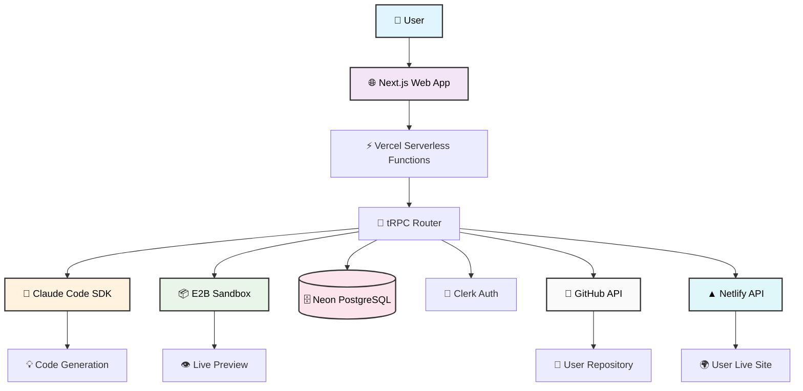
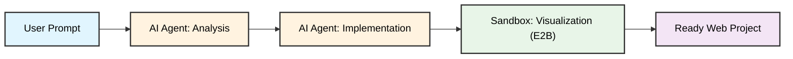
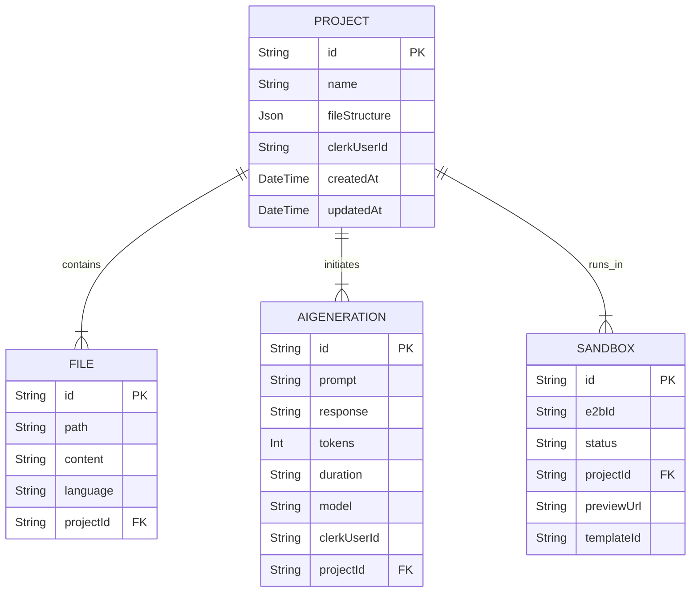
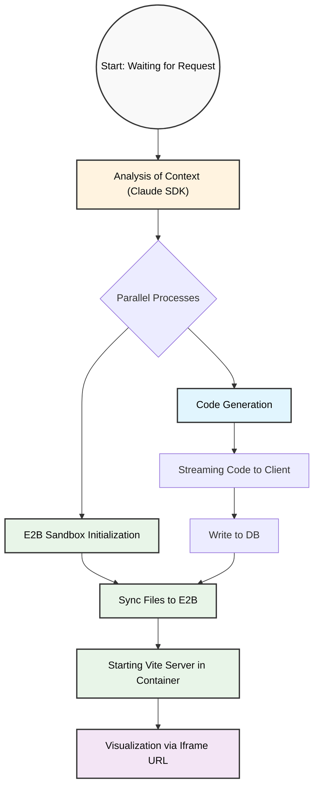
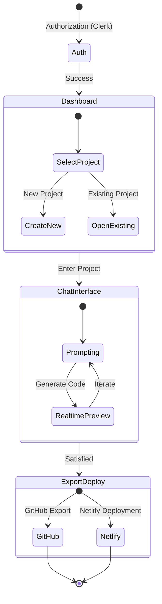

# Stryama Fullstack Architecture Document

## Introduction

This document outlines the complete fullstack architecture for **Stryama**, a conversational AI-powered application development platform. The architecture leverages a **serverless-first, TypeScript monorepo** approach built on the proven T3 Stack foundation, enhanced with Claude Code SDK for AI generation, E2B for sandboxed execution, and robust deployment integrations with Netlify and GitHub.

The system employs a **conversation-driven development paradigm** where users describe applications in natural language, triggering AI code generation that produces functional Next.js applications with real-time preview capabilities. Users can then export their projects to GitHub or deploy them live to Netlify directly from the platform.

### Starter Template

This project is built on the **T3 Stack** foundation, which provides:

- ✅ **Next.js 15+** with App Router and TypeScript
- ✅ **Prisma ORM** with PostgreSQL
- ✅ **tRPC** for end-to-end type safety
- ✅ **Tailwind CSS** with ShadCN/UI
- ✅ **Clerk** for Authentication

### Change Log

| Date       | Version | Description                                                                                                                                                          | Author           |
| ---------- | ------- | -------------------------------------------------------------------------------------------------------------------------------------------------------------------- | ---------------- |
| 2025-12-20 | 2.0     | Updated architecture to reflect MVP state: added React Query, removed Zustand, updated Tailwind version, added GitHub/Netlify integrations, and updated data models. | System Architect |
| 2025-09-28 | 1.0     | Initial architecture document creation                                                                                                                               | System Architect |

## High Level Architecture

### Technical Summary

This architecture leverages a **serverless-first, TypeScript monorepo** approach. The system employs a **conversation-driven development paradigm**. Key integration points include **tRPC for type-safe API communication**, **Prisma for robust data persistence**, and **E2B sandboxed environments** for secure code preview. The infrastructure leverages **Vercel's edge functions** for global distribution.

### Platform and Infrastructure Choice

**Platform:** Vercel (Frontend/API) + Neon (PostgreSQL)
**Key Services:**

- Vercel Serverless Functions (API routes)
- Neon PostgreSQL (primary database)
- Upstash/Vercel KV (Rate limiting)
- Clerk (Authentication)
- Anthropic Claude (AI Generation)
- E2B (Sandboxed Preview)
- Netlify (User App Deployment)
- GitHub (User App Export)

### High Level Architecture Diagram



### Conceptual Scheme of Intent-Based Development



## Tech Stack

### Technology Stack Table

| Category           | Technology       | Version | Purpose                 | Rationale                                                |
| ------------------ | ---------------- | ------- | ----------------------- | -------------------------------------------------------- |
| Package Manager    | PNPM             | 9.15+   | Package management      | Disk space efficient, fast, monorepo support             |
| Runtime            | Node.js          | 20+ LTS | JavaScript runtime      | Latest LTS version                                       |
| Frontend Language  | TypeScript       | 5.8+    | Type-safe development   | Prevents runtime errors, essential for complex workflows |
| Frontend Framework | Next.js          | 15.5+   | React framework         | App Router, serverless functions, T3 Stack integration   |
| React Library      | React            | 19.1+   | UI library              | Latest stable with concurrent features                   |
| UI Library         | ShadCN/UI        | Latest  | Accessible components   | Built on Radix, customizable                             |
| CSS Framework      | Tailwind CSS     | 3.4+    | Utility-first styling   | Industry standard, rapid UI development                  |
| State Management   | React Query      | 5.69+   | Server state management | Efficient data fetching, caching, and synchronization    |
| Backend API        | tRPC             | 11.0+   | Type-safe API           | End-to-end type safety, ideal for Next.js                |
| Database ORM       | Prisma           | 6.5+    | Type-safe ORM           | Robust data modeling and migrations                      |
| Database           | PostgreSQL       | 15+     | Primary database        | ACID compliance, relational data                         |
| Authentication     | Clerk            | Latest  | User management         | Secure, comprehensive auth and user profile management   |
| AI Engine          | Claude Code SDK  | Latest  | Code generation         | High-quality code generation capabilities                |
| Sandbox            | E2B              | 2.1+    | Secure execution        | Isolated environments for code preview                   |
| Deployment         | Vercel           | Latest  | App Hosting             | Best-in-class Next.js hosting                            |
| Integrations       | GitHub / Netlify | APIs    | Export & Deploy         | Allows users to own and publish their creations          |

## Data Models

**Note:** User authentication is handled entirely by Clerk. We do not store a separate `User` model for profile data; instead, we reference `clerkUserId` in all related models.

### Entity Relationship Diagram



### Project

**Purpose:** Container for user applications with complete file structure and configuration.

```prisma
model Project {
    id            String    @id @default(cuid())
    name          String
    fileStructure Json?
    clerkUserId   String    // References Clerk's user ID directly
    createdAt     DateTime  @default(now())
    updatedAt     DateTime  @updatedAt

    files              File[]
    sandboxes          Sandbox[]
    aiGenerations      AIGeneration[]
    githubExports      GitHubExport[]
    netlifyDeployments NetlifyDeployment[]

    @@index([clerkUserId])
}
```

### File

**Purpose:** Individual code files within projects.

```prisma
model File {
    id        String   @id @default(cuid())
    path      String
    content   String   @db.Text
    language  String?
    projectId String
    createdAt DateTime @default(now())
    updatedAt DateTime @updatedAt

    project Project @relation(fields: [projectId], references: [id], onDelete: Cascade)

    @@unique([projectId, path])
    @@index([projectId])
}
```

### AIGeneration

**Purpose:** Tracks AI-generated content, costs, and session data for context resumption.

```prisma
model AIGeneration {
    id          String   @id @default(cuid())
    prompt      String   @db.Text
    response    String   @db.Text
    tokens      Int?
    duration    Int?
    model       String?
    clerkUserId String
    projectId   String?
    sessionId   String?  // Claude session ID
    sessionData String?  @db.Text // Context for resumption
    totalCost   Float?
    createdAt   DateTime @default(now())

    project Project? @relation(fields: [projectId], references: [id], onDelete: SetNull)

    @@index([clerkUserId])
    @@index([projectId])
}
```

### Sandbox

**Purpose:** Tracks E2B sandbox environments for live previews.

```prisma
model Sandbox {
    id           String        @id @default(cuid())
    e2bId        String        @unique
    status       SandboxStatus @default(ACTIVE)
    projectId    String?
    previewUrl   String?
    templateId   String?
    lastActivity DateTime      @default(now())
    expiresAt    DateTime?
    metadata     Json?
    createdAt    DateTime      @default(now())
    updatedAt    DateTime      @updatedAt

    project Project? @relation(fields: [projectId], references: [id], onDelete: Cascade)

    @@index([projectId])
    @@index([expiresAt])
}
```

### Integrations & Usage

Additional models track user subscriptions, feedback, and external integrations:

- **UserUsage**: Tracks billing periods, plans (FREE, BUILDER, PRO), and generation counts.
- **GitHubConnection**: Stores encrypted OAuth tokens for GitHub access.
- **GitHubExport**: Logs history of project exports to GitHub repositories.
- **NetlifyConnection**: Stores encrypted OAuth tokens for Netlify access.
- **NetlifyDeployment**: Logs history of project deployments to Netlify sites.
- **Feedback**: Captures user bug reports and feature requests.
- **OAuthState**: Manages secure OAuth flows for external integrations.

## API Specification

### tRPC Router Architecture

The API layer is organized into domain-specific routers:

```typescript
export const appRouter = createTRPCRouter({
  project: projectRouter, // Project CRUD, file management
  ai: aiRouter, // Code generation, streaming
  sandbox: sandboxRouter, // E2B environment management
  usage: usageRouter, // Usage tracking and limits
  subscription: subscriptionRouter, // Plan management
  feedback: feedbackRouter, // User feedback submission
  github: githubRouter, // GitHub OAuth and export
  netlify: netlifyRouter, // Netlify OAuth and deployment
});
```

### Key API Patterns

1.  **Authentication**: All protected procedures verify Clerk authentication.
2.  **Rate Limiting**: Usage is checked against the user's plan limits (Free/Pro/Builder) before expensive operations (AI generation).
3.  **Input Validation**: Zod schemas validate all inputs.
4.  **Error Handling**: Standardized TRPC errors.

### Generation and Visualization Pipeline



## External APIs

### Claude Code SDK

- **Purpose**: Generates code based on user prompts.
- **Integration**: Streamed responses, context management via session data stored in `AIGeneration`.

### E2B Sandbox

- **Purpose**: Executes generated code in a secure, isolated environment.
- **Integration**: `e2b/code-interpreter` SDK for file syncing and process management.

### GitHub API

- **Purpose**: Allows users to export projects to their own GitHub accounts.
- **Flow**: OAuth -> Store Token -> Create Repo -> Push Files.

### Netlify API

- **Purpose**: Allows users to deploy projects to the live web.
- **Flow**: OAuth -> Store Token -> Create Site -> Deploy Files.

## Frontend Architecture

### User Flow Diagram



### Component Architecture

The frontend is built using **Next.js App Router** and **ShadCN/UI**.

- **`components/editor`**: Core development interface (Chat, Code View, Preview).
- **`components/dashboard`**: Project management and usage overview.
- **`components/landing`**: Marketing pages.
- **`components/github`** & **`components/netlify`**: Integration-specific UI flows.

### State Management

**TanStack React Query** is used for server state management, replacing global stores for data fetching. Local UI state is handled via React's `useState` and `useReducer` or specialized hooks (e.g., `useAIGenerationStream`).

## Deployment Architecture

- **Frontend/Backend**: Deployed on **Vercel**.
- **Database**: Hosted on **Neon**.
- **User Apps**: Deployed to **Netlify** (by user action) or previewed via **E2B**.

## Security and Performance

- **OAuth Tokens**: Stored encrypted in the database (GitHub/Netlify tokens).
- **Rate Limiting**: Implemented via in-memory Map storage for MVP simplicity. (Note: This resets on deployment/restart and is per-instance).
- **Sandboxing**: All user code runs in isolated E2B sandboxes, never on the main server.
- **CSP**: Content Security Policy configured to allow necessary iframe previews while blocking malicious scripts.
