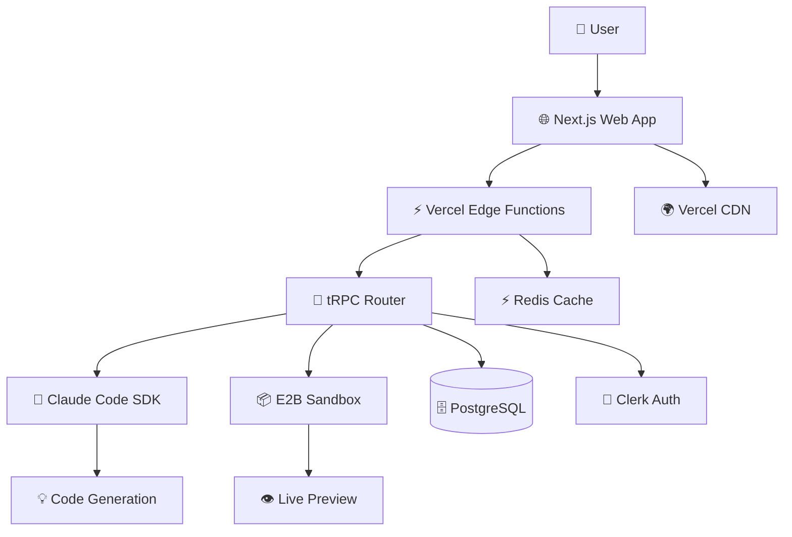
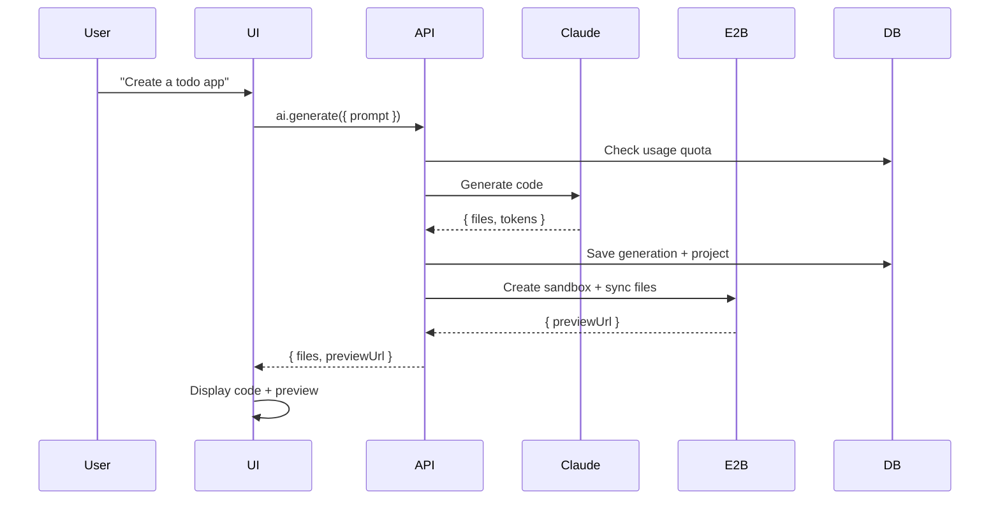
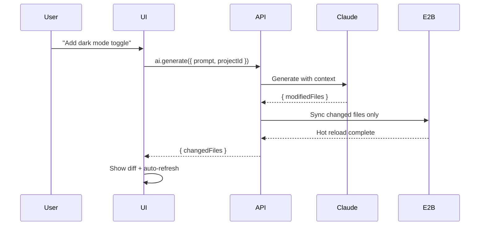

# Stryama Architecture Summary

## Overview

**Stryama** is a conversational AI-powered application development platform built on the T3 Stack foundation. Users describe applications in natural language, triggering AI code generation that produces functional Next.js applications with real-time preview capabilities.

**Key Goals:**
- Sub-5 second response times
- 99.5% uptime
- Seamless AI generation to preview workflow
- Support 10,000 users creating apps within 15 minutes

## High Level Architecture

### Technical Stack
- **Foundation:** T3 Stack (Next.js 15+, TypeScript, tRPC, Prisma)
- **AI Engine:** Claude Code SDK
- **Preview:** E2B Sandbox environments
- **Authentication:** Clerk
- **Database:** PostgreSQL (Neon)
- **Deployment:** Vercel Edge Functions
- **Cache:** Vercel KV (Redis)

### Architecture Diagram



### Architectural Patterns
- **Jamstack:** Static generation with serverless APIs
- **Component-Based UI:** React with TypeScript
- **Repository Pattern:** Prisma for data access
- **API Gateway:** tRPC for type-safe communication
- **Event-Driven:** Async AI generation with progress
- **Hexagonal:** Core logic isolated from external services

## Core Technology Stack

| Category | Technology | Purpose |
|----------|------------|---------|
| Frontend | Next.js 15+ | React framework with App Router |
| Language | TypeScript 5.3+ | Type safety across stack |
| UI Library | ShadCN/UI | Accessible component system |
| State Management | Zustand | Lightweight async state |
| API Layer | tRPC 10.45+ | End-to-end type safety |
| Database | PostgreSQL 15+ | Primary data persistence |
| Cache | Vercel KV | Response and session caching |
| Authentication | Clerk | User auth and management |
| AI Engine | Claude Code SDK | Natural language to code |
| Preview | E2B Sandbox | Secure code execution |
| Deployment | Vercel | Serverless functions + CDN |

## Data Models

### User
```typescript
interface User {
  id: string;
  clerkId: string;
  email: string;
  name?: string;
  plan: 'free' | 'pro' | 'enterprise';
  usageQuota: number;
  usageCount: number;
  resetDate: Date;
  createdAt: Date;
  updatedAt: Date;
}
```

### Project
```typescript
interface Project {
  id: string;
  userId: string;
  name: string;
  description?: string;
  framework: 'nextjs' | 'react' | 'vanilla' | 'custom';
  fileStructure: Record<string, any>;
  lastPreviewUrl?: string;
  status: 'draft' | 'active' | 'archived' | 'shared';
  isPublic: boolean;
  createdAt: Date;
  updatedAt: Date;
}
```

### File
```typescript
interface File {
  id: string;
  projectId: string;
  path: string;
  content: string;
  language: string;
  size: number;
  isGenerated: boolean;
  generationId?: string;
  createdAt: Date;
  lastModified: Date;
}
```

### AIGeneration
```typescript
interface AIGeneration {
  id: string;
  userId: string;
  projectId?: string;
  prompt: string;
  systemPrompt: string;
  response: {
    files: Array<{path: string, content: string, language: string}>;
    summary: string;
    metadata: Record<string, any>;
  };
  tokens: number;
  duration: number;
  success: boolean;
  errorMessage?: string;
  createdAt: Date;
}
```

### SandboxSession
```typescript
interface SandboxSession {
  id: string;
  projectId: string;
  userId: string;
  e2bSessionId: string;
  status: 'starting' | 'ready' | 'error' | 'stopped';
  previewUrl?: string;
  lastActivity: Date;
  resourceUsage: {
    cpu: number;
    memory: number;
    network: number;
  };
  createdAt: Date;
  expiresAt: Date;
}
```

## API Architecture

### tRPC Router Structure
```typescript
export const appRouter = createTRPCRouter({
  auth: authRouter,        // User authentication
  projects: projectRouter, // Project CRUD
  ai: aiRouter,           // AI code generation
  sandbox: sandboxRouter, // E2B sandbox management
  files: fileRouter,      // File operations
});
```

### Key API Patterns
- **Type Safety:** Zod schemas for all inputs/outputs
- **Authentication:** Clerk middleware on protected procedures
- **Error Handling:** Consistent TRPCError patterns
- **Rate Limiting:** Usage quota enforcement
- **Context Injection:** Database and auth available in procedures

## Core Workflows

### First-Time Generation


### Iterative Development


## Database Schema (Prisma)

```prisma
model User {
  id          String   @id @default(cuid())
  clerkId     String   @unique
  email       String   @unique
  name        String?
  plan        String   @default("free")
  usageQuota  Int      @default(50)
  usageCount  Int      @default(0)
  resetDate   DateTime @default(now())
  createdAt   DateTime @default(now())
  updatedAt   DateTime @updatedAt

  projects    Project[]
  generations AIGeneration[]
  sandboxes   Sandbox[]
  @@map("users")
}

model Project {
  id            String   @id @default(cuid())
  userId        String
  name          String
  description   String?
  framework     String   @default("nextjs")
  structure     Json     @default("{}")
  status        String   @default("draft")
  isPublic      Boolean  @default(false)
  shareToken    String?  @unique
  lastPreviewUrl String?
  createdAt     DateTime @default(now())
  updatedAt     DateTime @updatedAt

  user         User           @relation(fields: [userId], references: [id], onDelete: Cascade)
  files        File[]
  generations  AIGeneration[]
  sandboxes    Sandbox[]
  @@map("projects")
}

model File {
  id           String   @id @default(cuid())
  projectId    String
  path         String
  content      String
  language     String   @default("typescript")
  size         Int      @default(0)
  isGenerated  Boolean  @default(false)
  generationId String?
  createdAt    DateTime @default(now())
  lastModified DateTime @updatedAt

  project    Project       @relation(fields: [projectId], references: [id], onDelete: Cascade)
  generation AIGeneration? @relation(fields: [generationId], references: [id])
  @@unique([projectId, path])
  @@map("files")
}

model AIGeneration {
  id              String   @id @default(cuid())
  userId          String
  projectId       String?
  prompt          String
  systemPrompt    String   @default("")
  response        Json     @default("{}")
  tokens          Int      @default(0)
  duration        Int      @default(0)
  success         Boolean  @default(false)
  errorMessage    String?
  requestId       String?
  createdAt       DateTime @default(now())

  user    User     @relation(fields: [userId], references: [id], onDelete: Cascade)
  project Project? @relation(fields: [projectId], references: [id], onDelete: SetNull)
  files   File[]
  @@map("ai_generations")
}

model Sandbox {
  id             String   @id @default(cuid())
  projectId      String   @unique
  userId         String
  e2bSessionId   String   @unique
  status         String   @default("starting")
  previewUrl     String?
  lastActivity   DateTime @default(now())
  resourceUsage  Json     @default("{\"cpu\": 0, \"memory\": 0, \"network\": 0}")
  createdAt      DateTime @default(now())
  expiresAt      DateTime

  project Project @relation(fields: [projectId], references: [id], onDelete: Cascade)
  user    User    @relation(fields: [userId], references: [id], onDelete: Cascade)
  @@map("sandbox_sessions")
}
```

## Project Structure

```plaintext
stryama/
├── app/                              # Next.js App Router
│   ├── (auth)/                       # Auth pages
│   ├── (dashboard)/                  # Protected routes
│   ├── editor/[projectId]/           # Code editor
│   └── api/trpc/                     # tRPC endpoints
├── components/                       # React components
│   ├── ui/                           # ShadCN components
│   ├── ai/                           # AI-specific
│   ├── editor/                       # Code editor
│   └── project/                      # Project management
├── lib/                              # Utilities
│   ├── api.ts                        # tRPC client
│   ├── db.ts                         # Prisma client
│   └── integrations/                 # External services
├── server/api/                       # Backend
│   ├── root.ts                       # Main router
│   ├── trpc.ts                       # Configuration
│   └── routers/                      # API routes
├── types/                            # TypeScript definitions
├── prisma/                           # Database
│   ├── schema.prisma
│   └── migrations/
└── docs/                             # Documentation
```

## External API Integrations

### Claude Code SDK
- **Purpose:** AI code generation engine
- **Base URL:** https://api.anthropic.com/v1/
- **Auth:** API Key via Authorization header
- **Rate Limits:** Tier-based (5-1000 req/min)
- **Key Endpoints:**
  - `POST /code/generate` - Generate code from prompts
  - `POST /code/analyze` - Analyze existing code
  - `GET /usage` - Track token usage

### E2B Sandbox API
- **Purpose:** Secure code execution environments
- **Base URL:** https://api.e2b.dev/v1/
- **Auth:** API Key via x-api-key header
- **Rate Limits:** Plan-based (100-1000+ sessions/month)
- **Key Endpoints:**
  - `POST /sessions` - Create sandbox
  - `PUT /sessions/{id}/files` - Sync files
  - `GET /sessions/{id}/url` - Get preview URL
  - `DELETE /sessions/{id}` - Cleanup session

### Clerk Authentication
- **Purpose:** User auth and management
- **Base URL:** https://api.clerk.dev/v1/
- **Auth:** Bearer token
- **Rate Limits:** 1000 req/min per app
- **Integration:** Webhook-driven user sync to local DB

## Development & Deployment

### Environment Setup
```bash
# Install dependencies
pnpm install

# Setup environment
cp .env.example .env.local

# Database setup
pnpm db:push
pnpm db:seed

# Start development
pnpm dev
```

### Key Commands
- `pnpm dev` - Start all services
- `pnpm build` - Production build
- `pnpm test` - Run tests
- `pnpm db:studio` - Database admin
- `pnpm db:migrate` - Run migrations

### Deployment Strategy
- **Platform:** Vercel (automatic via git push)
- **Frontend:** Static generation + edge functions
- **Backend:** Serverless functions
- **Database:** Neon PostgreSQL with read replicas
- **CDN:** Vercel Edge Network (global)

### Environments
- **Development:** localhost:3000
- **Preview:** preview-xyz.vercel.app (automatic PR deployments)
- **Production:** stryama.com

## Performance & Security

### Performance Targets
- **Response Time:** <2s API calls, <5s AI generation
- **Bundle Size:** <250KB initial load
- **Database:** Indexed queries, connection pooling
- **Caching:** Redis for AI responses (24h), sessions (1h)

### Security Measures
- **Frontend:** CSP headers, XSS prevention, secure storage
- **Backend:** Input validation (Zod), rate limiting, CORS
- **Authentication:** Clerk session management
- **Data:** ACID compliance, encrypted at rest

### Rate Limiting
- **Free:** 10 req/min, 50 generations/month
- **Pro:** 50 req/min, 500 generations/month
- **Enterprise:** 100 req/min, unlimited generations

## Critical Development Rules

1. **Type Safety:** Use TypeScript strictly, Zod for validation
2. **API Communication:** tRPC exclusively, no direct HTTP
3. **State Management:** Zustand patterns, no direct mutations
4. **Database:** Repository pattern via Prisma
5. **Error Handling:** Consistent TRPCError patterns
6. **File Organization:** Absolute imports (@/), consistent naming
7. **Component Props:** Use 'type' definitions, not 'interface'
8. **Validation:** Runtime validation with automatic type inference
9. **Environment:** Validated config objects, not direct process.env
10. **Authentication:** Clerk middleware on all protected routes

---

This summarized architecture provides the essential technical foundation for building Stryama's conversational AI development platform while maintaining scalability, type safety, and performance requirements.